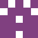

# Identicon 生成器 Laravel 版

本项目源自于 [yzalis/identicon](https://github.com/yzalis/Identicon)，它是一个 PHP 版的 Identicon 生成器，这个项目很棒，很多人都喜欢它，我不想侵权，但是它很久没更新了，我修复了一些错误并提交了 PR，但暂未得到合并。因此我临时做了一个 Laravel 版的 Identicon，如果可以的话，希望大家可以给源项目 [yzalis/identicon](https://github.com/yzalis/) 一个 star ⭐️。

---

**Identicon** 是一个基于字符串生成一个 [identicon](http://en.wikipedia.org/wiki/Identicon) 图像的库。

以下是一些精彩的输出例子！

&nbsp;&nbsp;
&nbsp;&nbsp;
&nbsp;&nbsp;
&nbsp;&nbsp;


## 安装

推荐通过 composer 安装 Identicon。

Step 1. 在你的项目中引入本库：

``` bash
composer require wuchienkun/laravel-identicon
```

Step 2. 发布配置文件：
``` bash
php artisan vendor:publish --tag=laravel-identicon
```

## 配置

发布配置文件后，可以在项目根目录的 `config` 文件夹中找到 `identicon.php`：

在这里可以选择默认的 Identicon Generator，默认使用的是 `imagick`。可选项有：`imagick`（需要安装 imagick 拓展），`gd`，`svg`。

``` php
'generator' => env('IDENTICON_GENERATOR', 'imagick')
```

可以在配置文件中修改 可以在 .env 文件中修改，例如：
```ini
IDENTICON_GENERATOR=gd
```
> 优先推荐 imagick, 其次推荐小尺寸使用 gd, 大尺寸使用 svg


## 使用

> 注意：
> 1. 生成的图像都是透明背景的 PNG 格式。
> 2. 字符串可以是邮箱，IP 地址，用户名，ID 或者其他的东西。

在 IdenticonServiceProvider 中已经注册了 identicon 单例，因此可以使用 `app('identicon')` 来获取 Identicon 实例。另外也注册了 Identicon Facade，也可以通过依赖注入的方式使用 Identicon。

### 获取 Identicon 实例

在 Laravel 中有 3 种方式获取 Identicon 实例：
``` php
// 1. 通过容器获取单例
app('identicon')->getImageDataUri('foo');
```

``` php
// 2. 通过 Facade 获取单例
\Wuchienkun\Identicon\Facades\Identicon::getImageDataUri('foo');
```

``` php
// 3. 依赖注入
public function index(\Wuchienkun\Identicon\Identicon $identicon)
{
    $identicon->getImageDataUri('foo');
    ...
}
```

### 1. getImageDataUri（获取图像 URI）
``` php
$identicon->getImageDataUri('foo'); 
```

得到的是一个 base64 格式的图片（例如：`data:image/png;base64,iVBORw0KGg...`），可以直接在 img 标签中使用：
``` html
getImageDataUri('foo') }}">
```

### 2. 修改图像大小

默认的大小是 64 像素。如果你想改变图像大小，只需要添加第二个参数。在这个例子中是 512 x 512px。

``` php
$identicon->getImageDataUri('foo', 512);
```

### 3. 图片颜色

图像颜色是由字符串的哈希值自动生成的，但是你可以添加第三个参数指定一个颜色。


``` php
// 颜色值可以使用一个 6 字符的十六进制字符串
$identicon->getImageDataUri('bar', 64, 'A87EDF');

$identicon->getImageDataUri('bar', 64, '#A87EDF');

// 也可以使用由红(R)、绿(G)、蓝(B)数值组成的数组
$identicon->getImageDataUri('foo', 64, array(200, 100, 150));
```

### 4. 背景色

图像默认的背景色是透明的，你可以通过添加第四个参数指定背景色，和前面的前景色一样。

``` php
$identicon->getImageDataUri('bar', 64, null, 'A87EDF');
```

### 5. 边距

默认是没有边距的，如果你想要带边距的图像，你可以添加第五个参数。推荐使用图像的大小的十分之一，实际图像的尺寸为`size + margin * 2`，即：图像的 size 为 100，边距为 10，则实际大小为 120*120。

在这个例子中，我们设置了灰色的背景，这样你可以很明显的看到边距：

&nbsp;&nbsp;
&nbsp;&nbsp;
&nbsp;&nbsp;
&nbsp;&nbsp;


```php
$identicon->getImageDataUri('foo', 100, null, '#f0f0f0', 10);
```

## 单元测试

为了运行单元测试，你需要一组依赖，它们可以通过 Composer 安装：

```
php composer.phar install
```

一旦安装，就可以使用下面的命令：

```
./vendor/bin/phpunit
```

应该一切都好了。
